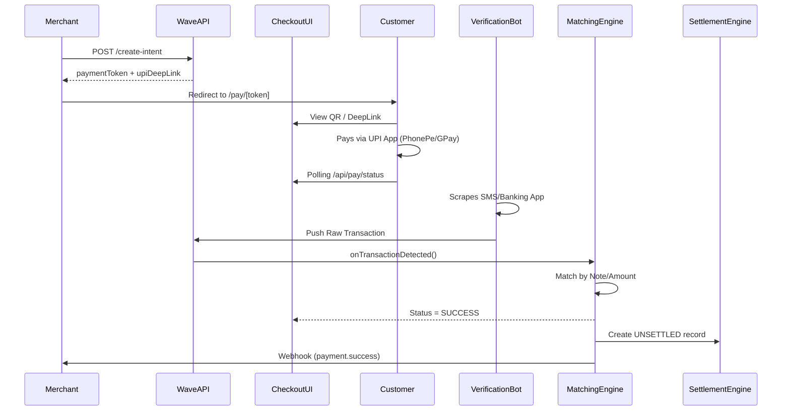

# 🏛️ WaveCollect System Architecture

This document explains the internal workflows, decision trees, and data structures that power the WaveCollect ecosystem.

---

## 1. Transaction Lifecycle

---

## 2. Risk Scoring Engine (`src/services/routing/`)

The system fingerprints every customer based on `IP + DeviceID + Phone`.

### User Tiers:
| Tier | Success Count | Logic | Routing |
|---|---|---|---|
| **HIGH** | 0 - 25 | New/Untrusted users | Burner VPAs, Small Limits |
| **MID** | 26 - 50 | Verified users | Stable VPAs, Medium Limits |
| **LOW** | 51+ | VIP/Whitelisted | Direct/Stable VPAs, Unlimited |

### Routing Decisions:
Every request to create an intent goes through `GatewayRouter.selectAccount()`:
1. **Health Check**: Only accounts with `healthScore > 80` are considered.
2. **Hard Caps**: Accounts with `> 100` successful txns today are excluded.
3. **Band Matching**: Matches the transaction amount to the VPA's `minTicket` / `maxTicket` band.
4. **Cooldown**: If an account was recently manually flagged, it enters a 4-hour cooldown.

---

## 3. Matching Engine Logic

The `MatchingEngine.ts` is the most critical component. It handles high-concurrency matching via the following strategy:

1.  **Strict Amount Matching**: Filters all `PENDING` intents for that merchant with the exact same amount.
2.  **Reference Note Check**: If the bot extracts a "Note" from the SMS, we match it against the `paymentToken`.
3.  **Customer Context**: If multiple intents exist for the same amount, it uses the `payerUpiId` from previous successful transactions for that `CustomerId`.
4.  **Floating State**: If no match is found, the transaction is moved to a `FLOATING` state for manual reconciliation.

---

## 4. Settlement & Custody Flow

WaveCollect operates on a **Custody Ledger** rather than pre-paid balance.

### Ledger States:
- **UNSETTLED**: Payment verified, but funds are in T+0 state.
- **HELD**: High-risk payment flagged by the engine. Requires admin release.
- **SETTLED**: Net funds (Total - 2% fee) moved to Merchant Balance.
- **PAID_OUT**: Funds physically transferred to the merchant's bank.

### The T+1 Batch:
The `SettlementEngine.processBatch()` runs every 24 hours. It:
1.  Identifies all `UNSETTLED` records older than 18 hours.
2.  Deducts the merchant commission (e.g., 2%).
3.  Calculates Agent Commissions (referral cut).
4.  Credits the Merchant's `walletBalance`.

---

## 5. Webhook Reliability (Dead Letter Queue)

All merchant notifications are managed by `WebhookService.ts`:
- **Initial Try**: Immediate delivery on match.
- **Retry Schedule**: Exponential backoff (1m, 5m, 1h, 6h, 24h).
- **Security**: All payloads are signed with `X-Wave-Signature` using the merchant's `webhookSecret`.
- **Manual Replay**: Failed webhooks can be re-triggered from the Admin Dashboard.
